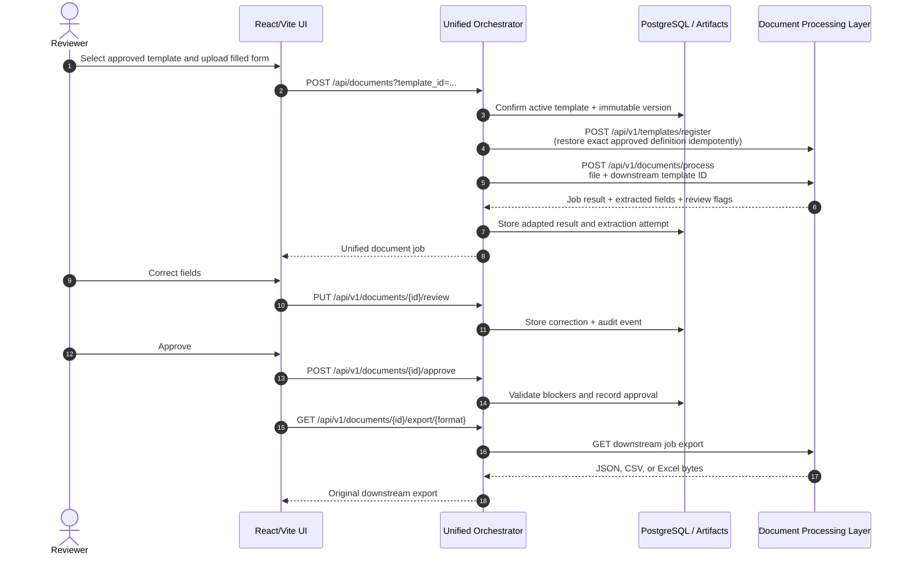

# Architecture

## Purpose and boundaries

The umbrella repository is an integration layer, not a monolith. Each service remains an independently versioned Git submodule and owns its model or domain behavior. The umbrella owns cross-service HTTP orchestration, payload adapters, review state, audit records, frontend deployment, shared configuration, and Compose topology.

The production request path is:

```text
React/Vite UI -> Nginx -> unified orchestrator -> independent model services
```

The prototype backend in `services/insurance-claim-ui/backend` is available only in the `frontend-standalone` profile and is never a production source of truth.

## Component ownership

| Component | Owns | Does not own |
|---|---|---|
| Visual field detection | Canonical preprocessing, page dimensions, page images, layout regions, table/cell geometry, visual artifacts | OCR text or semantic meaning |
| OCR FastAPI | Myanmar/English tokens, text normalization, token confidence and geometry | Canonical layout or template semantics |
| Insurance VLM | Semantic labels, proposed fields, coverage records, consistency warnings | Approval or template publication |
| Document processing | Approved-template ROI extraction, field OCR routing, validation, per-document exports | Blank-form semantic registration or human-review policy |
| Orchestrator | Correlation, workflow state, strict adapters, approval, immutable template versions, compatibility API, audit | Layout/OCR/VLM inference logic |
| React/Vite frontend | Human workflow and correction UI | Backend persistence or mock production processing |

## Blank-template registration sequence

```mermaid
sequenceDiagram
    autonumber
    actor Reviewer
    participant UI as React/Vite UI
    participant O as Unified Orchestrator
    participant DB as PostgreSQL / Artifacts
    participant L as Visual Field Detection
    participant OCR as OCR FastAPI
    participant VLM as Insurance VLM
    participant DPL as Document Processing Layer

    Reviewer->>UI: Upload blank insurance form
    UI->>O: POST /api/template-registrations
    O->>DB: Store source, job, correlation ID
    O->>L: POST /v1/documents (original bytes)
    L-->>O: visual document_id
    O->>L: POST /v1/documents/{id}/preprocess
    O->>L: POST /v1/documents/{id}/extract
    O->>L: GET /v1/documents/{id}/result
    L-->>O: visual_fields.json + exact page artifact path
    O->>L: GET /v1/documents/{id}/artifacts/{page_path}
    L-->>O: canonical preprocessed page bytes
    O->>DB: Store canonical page and SHA-256
    O->>OCR: POST /v1/ocr/process (same page bytes)
    OCR-->>O: paged OCR token JSON
    O->>O: Build strict OCR/layout contracts
    Note over O: Same document/page IDs, page number,<br/>SHA-256, width, height; validated pixel geometry
    O->>VLM: POST /api/v1/registrations<br/>image + OCR JSON + layout JSON
    VLM-->>O: PENDING job_id
    loop Bounded polling until completed, failed, or timeout
        O->>VLM: GET /api/v1/registrations/{job_id}
        VLM-->>O: job status
    end
    O->>VLM: GET /api/v1/registrations/{job_id}/result
    VLM-->>O: Semantic draft + coverage + review_required
    O->>DB: Store editable draft; status needs_approval
    O-->>UI: Draft, page, warnings, geometry
    Reviewer->>UI: Correct mappings and explicitly approve
    UI->>O: PUT draft / POST approve
    O->>O: Validate IDs, geometry, types, revision
    O->>DPL: POST /api/v1/templates/register
    DPL-->>O: Registered TemplateDefinition
    O->>DB: Store immutable approved version + audit
    O-->>UI: Active template
```

There is intentionally no transition from VLM completion directly to published template. Every VLM engine, including Qwen, produces a review-required result. Unsupported or ambiguous mappings block approval until a reviewer resolves them.

## Completed-document sequence



Re-registering before processing is required because the current document-processing repository stores its registry in memory. The approved definition itself is held in the orchestrator's immutable template-version record, so a document-processing container restart does not invalidate later work.

## Contract adaptation

All cross-service transformations live in `adapters/contracts.py` or workflow-specific adapter methods; route handlers do not invent service contracts.

### Authoritative page identity

The visual-field preprocessed page is the single authoritative image. `ImageIdentity` is computed from its exact bytes and contains:

- SHA-256
- pixel width and height
- visual document ID
- `page_###` page ID
- positive page number

Both Insurance-VLM payloads receive those same values. OCR is called with the same page bytes, and the raw OCR service's independent document identity is replaced at the adapter boundary. This prevents OCR/layout drift caused by separate resize or preprocessing operations.

### Geometry conventions

| Boundary | Format | Units |
|---|---|---|
| Visual layout and Insurance-VLM strict contract | `[x_min, y_min, x_max, y_max]` | Page pixels |
| Current OCR response | `bounding_box` as `xyxy` | Page pixels |
| Legacy OCR examples | normalized `xyxy` | 0 to 1 |
| Editable frontend draft | `{x, y, width, height}` | Normalized 0 to 1 |
| Document-processing TemplateDefinition | `{x, y, width, height}` | Page pixels |

Every conversion checks finite coordinates, positive area, and page bounds. Missing geometry is an error; it is never fabricated. Values whose four OCR coordinates all lie in 0..1 are the only values treated as legacy normalized boxes.

### Stable IDs and table structure

OCR token IDs and layout region IDs are sanitized with stable prefixes, then checked for collisions. A `TABLE_CELL` must contain `parent_region_id`, and its parent must resolve to a `TABLE`. Parent/child links are mapped through the same stable ID map and preserved in the VLM layout contract.

### Field types

Approved fields must resolve to one of the document-processing values:

- `printed_text`
- `handwriting`
- `checkbox`
- `table`
- `signature`

The adapter maps known VLM data types and reviewer-selected extraction modes. Unknown values produce explicit review flags and block registration rather than silently becoming printed text.

## Persistence and storage

| Data | Storage | Notes |
|---|---|---|
| Orchestrator registrations, templates, immutable versions, documents, audit | PostgreSQL `orchestrator_records` JSON records | Durable across orchestrator restarts |
| Orchestrator source/canonical page files | `orchestrator_artifacts` volume | Sensitive; back up with database |
| Visual metadata | PostgreSQL | Visual service runs its own migrations |
| Visual originals, pages, crops, overlays, manifests | `visual_field_data` volume | Paths/hashes are referenced by database rows |
| Document crops and exports | `generated_documents` volume | Document service job registry itself is in memory |
| Insurance-VLM inputs/status/results | `vlm_jobs` or `vlm_gpu_jobs` volume | In-process pending queue is not resumed automatically |
| Layout, document OCR, and VLM models | Separate named volumes | Never part of Git or image layers |
| Prototype backend JSON | `prototype_runtime` volume | Standalone profile only; never production data |

PostgreSQL has no host port in committed Compose. The platform network is a user-defined bridge; services address one another by Compose DNS name and actual container port.

## Reliability

- Each incoming request gets a validated supplied correlation ID or a generated UUID.
- The ID is returned in `X-Correlation-ID` and forwarded downstream.
- Downstream timeouts, attempt counts, backoff, polling interval, and polling timeout are configurable.
- Network errors, 5xx responses, and 429 responses receive bounded exponential retries.
- Permanent 4xx responses are surfaced immediately and not retried.
- Workflow failures are stored with safe service-specific details so asynchronous clients can inspect them.
- Upload extensions and streamed byte size are validated before persistence.
- Draft revisions use optimistic concurrency and return 409 for stale edits.
- Approval is idempotent for an already registered template and blocked for invalid draft state.

The orchestrator currently uses FastAPI background tasks and Insurance-VLM uses an in-process queue. For horizontally scaled production, replace these with a durable queue and explicit worker ownership before expecting crash-resume semantics.

## Security and privacy

- API keys and database credentials come only from environment/secret management.
- VLM authentication is forwarded with `X-API-Key` when configured.
- Logs contain request metadata, IDs, stages, and safe error summaries, not raw documents or OCR/VLM payloads.
- Model and runtime patterns are excluded by both Git and root Docker context rules.
- Nginx limits request bodies and proxies only the unified `/api` surface.
- Direct service host ports are for local development; production ingress should expose only the frontend and orchestrator behind TLS, authentication, authorization, rate limits, and audit policy.
- Artifact/database backups and retention must be coordinated because either store alone is incomplete.

## Actual-service constraints

These constraints are verified from the pinned code and influence the umbrella design:

1. Visual-field preprocessing and extraction are synchronous HTTP operations even though the orchestrator presents an asynchronous job abstraction.
2. Insurance-VLM v1 accepts one page per registration. The orchestrator rejects multi-page template registration rather than selecting or merging pages silently.
3. Insurance-VLM mock mode validates contracts but does not create semantic fields; reviewers must map fields before approval.
4. The OCR README's flat sample is older than its current paged Pydantic response. The adapter follows the code.
5. Document processing synchronously returns a job record, uses in-memory registries, and generates exports on its persistent storage mount.
6. The React frontend's compatibility client is maintained inside its submodule, while all production compatibility endpoints and records are served by the umbrella orchestrator.

## Deployment profiles

- Default: full CPU-oriented platform, Insurance-VLM mock engine, production-style Nginx UI.
- `frontend-dev`: Vite dev server on 5173 in addition to the unified backend.
- `frontend-standalone`: prototype FastAPI backend on 8005, isolated from production workflow state.
- `gpu`: Qwen-capable VLM image on 18004 with NVIDIA reservation and external model cache.
- `tools`: one-shot layout model volume loader.
- `compose.mock.yaml`: PostgreSQL, downstream doubles, real orchestrator, and built frontend for GPU/model-free integration testing.
