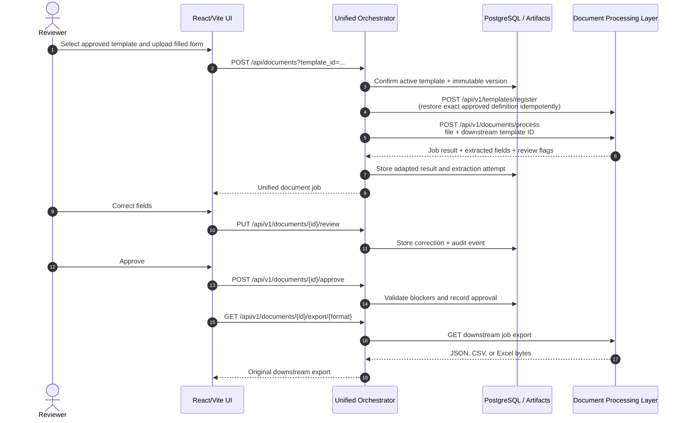

# Architecture

## Purpose and boundaries

The umbrella repository is an integration layer, not a monolith. Each service remains an independently versioned Git submodule and owns its model or domain behavior. The umbrella owns cross-service HTTP orchestration, payload adapters, review state, audit records, frontend deployment, shared configuration, and Compose topology.

The production request path is:

```text
React/Vite UI -> Nginx -> unified orchestrator -> independent model services
```

The prototype backend in `services/insurance-claim-ui/backend` is available only in the `frontend-standalone` profile and is never a production source of truth.

## Component ownership

| Component | Owns | Does not own |
|---|---|---|
| Visual field detection | Canonical preprocessing, page dimensions, page images, layout regions, table/cell geometry, visual artifacts | OCR text or semantic meaning |
| OCR FastAPI | Myanmar/English tokens, text normalization, token confidence and geometry | Canonical layout or template semantics |
| Insurance VLM | Semantic labels, proposed fields, coverage records, consistency warnings | Approval or template publication |
| Document processing | Approved-template ROI extraction, field OCR routing, validation, per-document exports | Blank-form semantic registration or human-review policy |
| Orchestrator | Correlation, workflow state, strict adapters, approval, immutable template versions, compatibility API, audit | Layout/OCR/VLM inference logic |
| React/Vite frontend | Human workflow and correction UI | Backend persistence or mock production processing |

## Form catalog and lifecycle

The orchestrator's durable record store also owns the user-managed form catalog:

```text
category (stable ID, mutable name/description)
   └── registration (source metadata, pipeline state, editable draft)
          └── template (current approved catalog entry)
                 └── template_version (immutable approved extraction definition)
```

The four initial insurance categories are seeded records only; request validation resolves a
category ID from storage and therefore accepts user-created categories. Category renames do not
change referenced IDs. Deletion is blocked while an active registration or template references
the category.

Registration/template names, descriptions, and category assignments are mutable catalog
metadata. Updating the metadata of an approved registration synchronizes its current `template`
record, while `template_version.definition` remains immutable. Archiving a registration also
archives its linked approved template. Archiving an approved template also hides its linked
registration. Artifacts, versions, audits, and historical documents are deliberately retained.

## Blank-template registration sequence

```mermaid
sequenceDiagram
    autonumber
    actor Reviewer
    participant UI as React/Vite UI
    participant O as Unified Orchestrator
    participant DB as PostgreSQL / Artifacts
    participant L as Visual Field Detection
    participant OCR as OCR FastAPI
    participant VLM as Insurance VLM
    participant DPL as Document Processing Layer

    Reviewer->>UI: Upload blank insurance form
    UI->>O: POST /api/template-registrations
    O->>DB: Store source, job, correlation ID
    O->>L: POST /v1/documents (original bytes)
    L-->>O: visual document_id
    O->>L: POST /v1/documents/{id}/preprocess
    L-->>O: manifest containing all canonical page artifacts
    loop Every canonical page
        O->>L: GET /v1/documents/{id}/artifacts/{page_path}
        L-->>O: exact canonical page bytes
        O->>DB: Store page, SHA-256, dimensions, and page number
    end
    par Document-wide layout extraction
        O->>L: POST /v1/documents/{id}/extract
        O->>L: GET /v1/documents/{id}/result
        L-->>O: visual_fields.json for all pages
    and Page-scoped OCR
        loop Every canonical page
            O->>OCR: POST /v1/ocr/process (same page bytes + page_number)
            OCR-->>O: one-page OCR token JSON
        end
    end
    loop Every page, sequentially
        O->>O: Build strict one-page OCR/layout contracts
        Note over O: Same document/page IDs, page number,<br/>SHA-256, width, height; validated pixel geometry
        O->>VLM: POST /api/v1/registrations<br/>one image + matching OCR/layout JSON
        VLM-->>O: PENDING job_id
        loop Bounded polling until terminal
            O->>VLM: GET /api/v1/registrations/{job_id}
            VLM-->>O: job status
        end
        O->>VLM: GET /api/v1/registrations/{job_id}/result
        VLM-->>O: Page semantic draft + coverage + review_required
    end
    O->>O: Merge page drafts and make field IDs/keys unique
    O->>DB: Store editable draft; status needs_approval
    O-->>UI: Draft, page, warnings, geometry
    Reviewer->>UI: Correct mappings and explicitly approve
    UI->>O: PUT draft / POST approve
    O->>O: Validate IDs, geometry, types, revision
    O->>DPL: POST /api/v1/templates/register
    DPL-->>O: Registered TemplateDefinition
    O->>DB: Store immutable approved version + audit
    O-->>UI: Active template
```

There is intentionally no transition from VLM completion directly to published template. Every VLM engine, including Qwen, produces a review-required result. Unsupported or ambiguous mappings block approval until a reviewer resolves them.

## Completed-document sequence



Re-registering before processing is required because the current document-processing repository stores its registry in memory. The approved definition itself is held in the orchestrator's immutable template-version record, so a document-processing container restart does not invalidate later work.

## Contract adaptation

All cross-service transformations live in `adapters/contracts.py` or workflow-specific adapter methods; route handlers do not invent service contracts.

### Authoritative page identity

Each visual-field preprocessed page is an authoritative image. An `ImageIdentity` is computed from the exact bytes of every page and contains:

- SHA-256
- pixel width and height
- visual document ID
- `page_###` page ID
- positive page number

The matching Insurance-VLM payload receives those same values. OCR is called with the same page bytes and explicit page number, and the raw OCR service's independent document identity is replaced at the adapter boundary. This prevents OCR/layout drift caused by separate resize or preprocessing operations.

### Multi-page fan-out and merge

Insurance-VLM deliberately retains its strict one-page registration contract. The orchestrator turns a multi-page source into that contract without losing page identity:

1. The visual service renders/canonicalizes all source pages and returns one ordered manifest.
2. The orchestrator downloads and validates every page before inference starts.
3. Layout extraction runs once for the document while OCR runs once per canonical page.
4. The orchestrator selects only that page's layout regions and OCR tokens, then creates one strict VLM registration per page.
5. VLM registrations run sequentially. This is intentional for small GPU hosts such as a 4 GB GTX 1650.
6. The page drafts are merged into `draft.pages` and page-tagged `draft.regions`. Duplicate generated field IDs and keys are deterministically deconflicted across the whole form.

The saved editable draft always contains every page. Selecting a page in the UI changes only which regions are displayed; saving sends the complete region collection so edits on another page are not lost.

### Implementation map

Use these files to follow the construction from input to approval:

| Concern | Main implementation |
|---|---|
| Registration state machine, canonical page collection, per-page OCR/VLM fan-out, and draft merge | [`orchestrator/workflows.py`](orchestrator/workflows.py) |
| Public registration, page-image, save, validate, and approval routes | [`orchestrator/main.py`](orchestrator/main.py) |
| Identity/geometry validation, strict VLM contracts, and normalized-to-integer approval conversion | [`adapters/contracts.py`](adapters/contracts.py) |
| Camera-vs-digital preprocessing decision and capture-quality aggregation | [`services/visual-field-detection/app/preprocessing.py`](services/visual-field-detection/app/preprocessing.py) |
| OCR page numbering, exact image hashing, paged token response | [`services/ocr-fastapi-service/app/ocr_engine.py`](services/ocr-fastapi-service/app/ocr_engine.py) |
| Runtime template page schema and bounds validation | [`services/document-processing-layer/app/models/schemas.py`](services/document-processing-layer/app/models/schemas.py) |
| PDF rendering and page-aware runtime extraction | [`services/document-processing-layer/app/api/endpoints/documents.py`](services/document-processing-layer/app/api/endpoints/documents.py), [`pipeline_orchestrator.py`](services/document-processing-layer/app/services/pipeline_orchestrator.py) |
| Frontend page selection, page-local rendering, and full-draft save | [`TemplateWorkspace.tsx`](burmese-ocr-system-UI/src/components/TemplateWorkspace.tsx), [`src/api`](burmese-ocr-system-UI/src/api) |

### Geometry conventions

| Boundary | Format | Units |
|---|---|---|
| Visual layout and Insurance-VLM strict contract | `[x_min, y_min, x_max, y_max]` | Page pixels |
| Current OCR response | `bounding_box` as `xyxy` | Page pixels |
| Legacy OCR examples | normalized `xyxy` | 0 to 1 |
| Editable frontend draft | `{x, y, width, height}` | Normalized 0 to 1 |
| Document-processing TemplateDefinition | `{x, y, width, height}` plus field `page` | Pixels of the referenced template page |

Every conversion checks finite coordinates, positive area, and page bounds. Missing geometry is an error; it is never fabricated. Values whose four OCR coordinates all lie in 0..1 are the only values treated as legacy normalized boxes.

### Stable IDs and table structure

OCR token IDs and layout region IDs are sanitized with stable prefixes, then checked for collisions. A `TABLE_CELL` must contain `parent_region_id`, and its parent must resolve to a `TABLE`. Parent/child links are mapped through the same stable ID map and preserved in the VLM layout contract.

### Field types

Approved fields must resolve to one of the document-processing values:

- `printed_text`
- `handwriting`
- `checkbox`
- `table`
- `signature`

The adapter maps known VLM data types and reviewer-selected extraction modes. Unknown values produce explicit review flags and block registration rather than silently becoming printed text.

## Persistence and storage

| Data | Storage | Notes |
|---|---|---|
| Orchestrator registrations, templates, immutable versions, documents, audit | PostgreSQL `orchestrator_records` JSON records | Durable across orchestrator restarts |
| Form categories | PostgreSQL `orchestrator_records` records with `kind=category` | Stable IDs; user-managed names/descriptions; initial four are seeded |
| Orchestrator source/canonical page files | `orchestrator_artifacts` volume | Sensitive; back up with database |
| Visual metadata | PostgreSQL | Visual service runs its own migrations |
| Visual originals, pages, crops, overlays, manifests | `visual_field_data` volume | Paths/hashes are referenced by database rows |
| Document crops and exports | `generated_documents` volume | Document service job registry itself is in memory |
| Insurance-VLM inputs/status/results | `vlm_jobs` or `vlm_gpu_jobs` volume | In-process pending queue is not resumed automatically |
| Layout, document OCR, and VLM models | Separate named volumes | Never part of Git or image layers |
| Prototype backend JSON | `prototype_runtime` volume | Standalone profile only; never production data |

PostgreSQL has no host port in committed Compose. The platform network is a user-defined bridge; services address one another by Compose DNS name and actual container port.

## Reliability

- Each incoming request gets a validated supplied correlation ID or a generated UUID.
- The ID is returned in `X-Correlation-ID` and forwarded downstream.
- Downstream timeouts, attempt counts, backoff, polling interval, and polling timeout are configurable.
- Network errors, 5xx responses, and 429 responses receive bounded exponential retries.
- Permanent 4xx responses are surfaced immediately and not retried.
- Workflow failures are stored with safe service-specific details so asynchronous clients can inspect them.
- Upload extensions and streamed byte size are validated before persistence.
- Draft revisions use optimistic concurrency and return 409 for stale edits.
- Approval is idempotent for an already registered template and blocked for invalid draft state.

The orchestrator currently uses FastAPI background tasks and Insurance-VLM uses an in-process queue. For horizontally scaled production, replace these with a durable queue and explicit worker ownership before expecting crash-resume semantics.

## Security and privacy

- API keys and database credentials come only from environment/secret management.
- VLM authentication is forwarded with `X-API-Key` when configured.
- Logs contain request metadata, IDs, stages, and safe error summaries, not raw documents or OCR/VLM payloads.
- Model and runtime patterns are excluded by both Git and root Docker context rules.
- Nginx limits request bodies and proxies only the unified `/api` surface.
- Direct service host ports are for local development; production ingress should expose only the frontend and orchestrator behind TLS, authentication, authorization, rate limits, and audit policy.
- Artifact/database backups and retention must be coordinated because either store alone is incomplete.

## Actual-service constraints

These constraints are verified from the pinned code and influence the umbrella design:

1. Visual-field preprocessing and extraction are synchronous HTTP operations even though the orchestrator presents an asynchronous job abstraction.
2. Insurance-VLM v1 accepts one page per registration. The orchestrator creates sequential page-scoped VLM jobs and merges their results into one draft; it never silently selects only the first page.
3. Insurance-VLM mock mode validates contracts but does not create semantic fields; reviewers must map fields before approval.
4. OCR returns a paged Pydantic response. The adapter validates each page against its canonical visual identity before building a VLM contract.
5. Completed documents are first canonicalized by visual-field detection (paper boundary crop and perspective correction where appropriate). Template matching and OCR then use those canonical pages, with only a dimension-normalizing resize rather than a second feature-based template warp. The document-processing service returns a job record, applies each field to its declared page, uses in-memory registries, and generates exports on its persistent storage mount.
6. The primary React/TypeScript frontend is maintained in `burmese-ocr-system-UI`; its domain client talks only to the umbrella orchestrator. The legacy UI submodule is not part of the production build.

## Deployment profiles

- Default: full CPU-oriented platform, Insurance-VLM mock engine, production-style Nginx UI.
- `frontend-dev`: Vite dev server on 5173 in addition to the unified backend.
- `frontend-standalone`: prototype FastAPI backend on 8005, isolated from production workflow state.
- `gpu`: Qwen-capable VLM image on 18004 with NVIDIA reservation and external model cache.
- `tools`: one-shot layout model volume loader.
- `compose.mock.yaml`: PostgreSQL, downstream doubles, real orchestrator, and built frontend for GPU/model-free integration testing.
